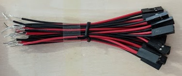

### Si ta lidhni RigCtrl Reset paisjen

1. Ju nevojitet kabëll i gjatë për secilin rig nga vendi i paisjes deri te rig-u
    - Një zgjedhje e mirë e kabllit për 4 rig-a ështe kablli i rrjetës (UTP) si kjo:
    

2. Vazhdo telat e kabllit me kabllin kuq e zi (2 pina) që vijnë me paisjen (që përdoret për tu vendosur në motherboard)
    

3. Ana tjetër e kabllit (pa pina) lidhet si në foto
    - Secili port ka 3 vrima, përdor vetëm ato vrima (me të gjelbërt) si në foto
    

4. Lidh kabllin me 2 pin-a në panelin e On/Off në motherboard
    - _Konsulltohu me udhëzimin e motherboard-it tuaj për të gjetur On/Off pin-at_
    

    !!! info "Telat në mes paisjes dhe motherboard nuk kanë rryme, kështu që radhitja e ngjyrave nuk është e rëndësishme"

5. Zgjedhja e portës për rig
    - Kliko në **Rig/Group List** nga menyja, në Rig listën zgjedh portën nga lista ku rig-u është i lidhur dhe ruaj, ose
    - Nga faqja e parë hap menynë e rig-ut, kliko **Modifiko rigun**, zgjedh portën dhe ruaj ndryshimet

!!! attention
    Nëse keni më shumë se një RigCtrl Reset paisje, kliko në **Konfigurimet e avancuara**, në fund të faqës zgjedh nga lista sasinë **Numri i RigCtrl Reset paisjeve** dhe ruaj
